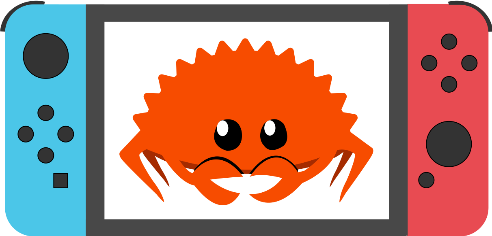

# Joycon-rs


A framework for dealing with Nintendo Switch Joy-Con on Rust easily and efficiently.

`Joycon-rs` provides utility to find communicate with, and operate Joy-Con. 
Please see the documentation comments for detailed instructions on how to use it.

 Joycon-rs is in development and is still incomplete.
 Please be aware that the update will include breaking changes for the time being. Pardon out dust!

# Setup
On macOS or Windows, there are no preparation.

On linux, 
```
sudo apt-get install libudev-dev libusb-1.0-0-dev libfox-1.6-dev
```

 # Usage
 First, add dependency to `Cargo.toml`

 ```toml
[dependencies]
joycon_rs = "*"
 ```

 Then, `use` prelude on `.rs` file.
 ```
 use joycon_rs::prelude::*;
 ```

 Perfect! Now you have Joycon-rs available in code.

 ### Receive reports
 For starters, let's take a simple signal from JoyCon.
 If you have more than one JoyCon, [`mspc`] can be very helpful.

 ```no_run
 use joycon_rs::prelude::*;

 let (tx, rx) = std::sync::mpsc::channel();

 JoyConManager::new()
     .unwrap()
     .connected_joycon_devices
     .into_iter()
     .flat_map(|dev| SimpleJoyConDriver::new(dev))
     .try_for_each::<_, JoyConResult<()>>(|driver| {
         // Change JoyCon to Simple hid mode.
         let simple_hid_mode = SimpleHIDMode::new(driver)?;

         let tx = tx.clone();

         // Spawn thread
         std::thread::spawn( move || {
             loop {
                 // Forward the report to the main thread
                 tx.send(simple_hid_mode.read_input_report()).unwrap();
             }
         });

         Ok(())
     })
     .unwrap();

 // Receive reports from threads
 while let Ok(report) = rx.recv() {
     // Output report
     dbg!(report);
 }
 ```

 ### Ser player lights
 Then, lets deal with player lights.

 ```no_run
 use joycon_rs::prelude::{*, lights::*};

 let (tx, rx) = std::sync::mpsc::channel();

 JoyConManager::new()
     .unwrap()
     .connected_joycon_devices
     .into_iter()
     .flat_map(|dev| SimpleJoyConDriver::new(dev))
     .try_for_each::<_, JoyConResult<()>>(|mut driver| {
         // Set player lights
         // [SL BUTTON] 📸💡📸💡 [SR BUTTON]
         driver.set_player_lights(&vec![LightUp::LED1, LightUp::LED3], &vec![Flash::LED0, Flash::LED2]).unwrap();
         tx.send(driver.get_player_lights()).unwrap();
         Ok(())
     })
     .unwrap();

 // Receive status of player lights
 while let Ok(Ok(light_status)) = rx.recv() {
     assert_eq!(
         light_status.extra.reply,
         LightsStatus {
             light_up: vec![LightUp::LED1, LightUp::LED3],
             flash: vec![Flash::LED0, Flash::LED2],
         }
     )
 }
 ```

 # Features
 You can use `Joycon-rs` for...
 - Send / Receive raw packets (u8 array) to / from Joy-Con
 - Receive input to Joy-Con
     - Receive pushed buttons, and stick directions (one of 8 directions) on every button pressed.
     - Receive pushed buttons, stick directions (analog value), and 6-Axis sensor at 60Hz.
     - Get status of Joy-Con
 - Deal with LED (Player lights)

 ## Planning
 - Vibration (Rumble)
 - Receive NFC/IR data
 - Deal with HOME light
 - Deal with Pro Controller
 - Disconnect / Reconnect
 
[`mspc`]: https://doc.rust-lang.org/book/ch16-02-message-passing.html
